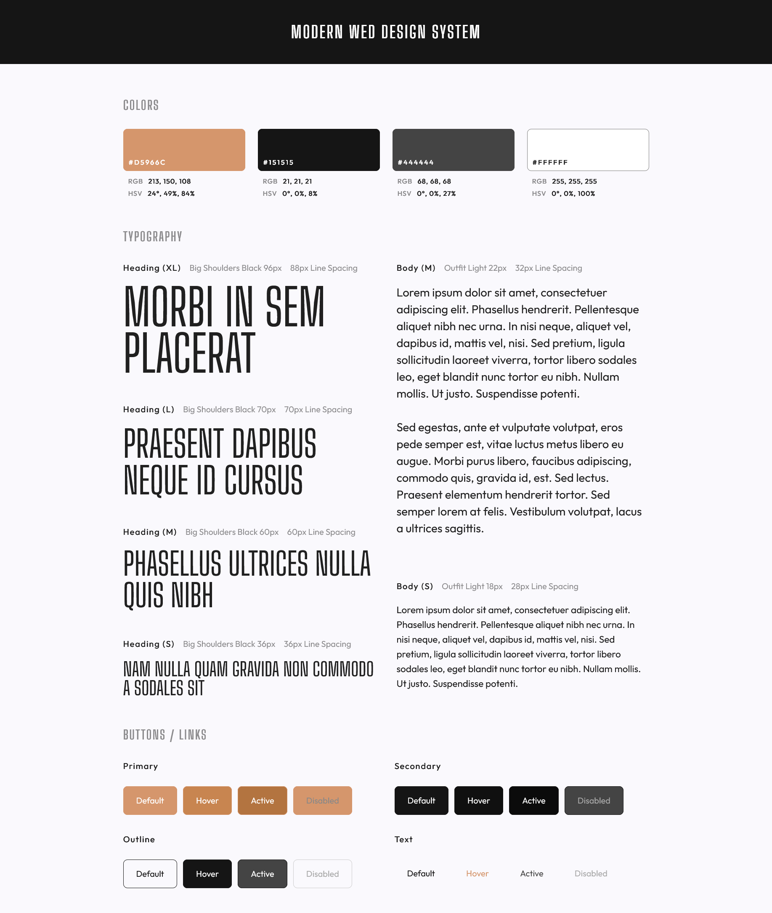

# A Website Design System / Codecademy

This is a solution to the **"Challenge Project: Build a Website Design System"** on Codecademy.

The goal of this project was to create a **personal website design system** — a visual and typographic reference to support consistent front-end development in future web projects.

---

## Table of contents

- [A Website Design System / Codecademy](#a-website-design-system--codecademy)
  - [Table of contents](#table-of-contents)
  - [Overview](#overview)
  - [Screenshot](#screenshot)
  - [Project Goals](#project-goals)
  - [Features](#features)
  - [Links](#links)
  - [Built With](#built-with)
  - [Author](#author)
  - [License](#license)

---

## Overview

This project serves as a foundation for developing consistent, modern, and reusable user interface components.  
It includes defined **color palettes**, **typography styles**, and **button states**, forming a cohesive design system suitable for responsive web development.

---

## Screenshot

---

## Project Goals

- Build a personal website design system for future projects.
- Collect and organize reusable styles (colors, typography, components).
- Practice semantic HTML and modular CSS.
- Establish a scalable, maintainable visual structure for UI/UX consistency.

---

## Features

- 🎨 **Color Palette** — Primary, Secondary, Neutral, and Accent tones with RGB/HSV values.  
- ✍️ **Typography System** — Headings and body text defined with consistent sizing, spacing, and font hierarchy.  
- 🔘 **Button Library** — Four styles (`Primary`, `Secondary`, `Outline`, `Text`) each with interaction states (`Default`, `Hover`, `Active`, `Disabled`).  
- 💡 **Custom CSS Variables** — All colors, font sizes, and spacing defined via CSS variables for maintainability.  
- 📱 **Responsive Design Foundation** — Flexible layout prepared for adaptive scaling.  
- ⚡ **Fast Loading Fonts** — Optimized with `<link rel="preload">` and `noscript` fallback.

---

## Links

- **Project Description:** [Codecademy Challenge Project](https://www.codecademy.com/journeys/front-end-engineer/paths/fecj-22-improved-styling-with-css/tracks/fecj-22-improved-styling-with-css/modules/wdcp-22-build-a-website-design-system-c09e9da3-4b42-409f-8aa2-470c801d653b/projects/independent-project-web-design-system)
- **Live Demo:** [[Add live site URL here](https://axinitm.github.io/A-Website-Design-System/)]
- **Source Code:** [[Add GitHub repository URL here](https://github.com/AxinitM/A-Website-Design-System)]

---

## Built With

- Semantic **HTML5** markup  
- **CSS Custom Properties (Variables)**  
- **Flexbox** and **Grid** layout  
- **Google Fonts (Big Shoulders, Outfit)**  
- Responsive-ready structure  
- No frameworks — **pure front-end implementation**

---

## Author

- **Website:** [Andrei Martinenko](https://www.frontender.biz/)  
- **GitHub:** [@AxinitM](https://github.com/AxinitM)  
- **Codecademy Profile:** [Andrei Martinenko](https://www.codecademy.com/profiles/system5869051486)

---

## License

This project is open-source and available under the [MIT License](LICENSE).
